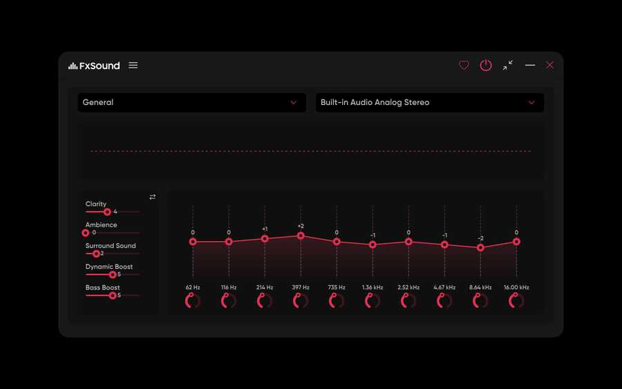

# FxSound Linux

**An unofficial native Linux port of the open-source FxSound audio enhancer.**

FxSound Linux keeps the real upstream **DfxDsp** processing engine and original FxSound factory presets, replaces the Windows WASAPI/virtual-driver layer with **PipeWire**, and reuses FxSound's JUCE visual language for a native Linux desktop UI.

> **Status:** v0.1.0-alpha — usable and tested on Kali Linux, but still an early community port.



## Why this exists

FxSound's application and DSP source are open source, but the official desktop app targets Windows. This project ports the audio path to Linux while keeping Linux-specific changes at the platform boundary so the actual FxSound processing stays as close to upstream as practical.

### Current Windows-parity work

- Real upstream FxSound **DfxDsp** engine
- Byte-for-byte upstream factory `.fac` presets
- 32-bit floating-point processing
- 48 kHz processing on 48 kHz-family devices
- Windows-style ~40 ms / 1920-frame processing cadence on 48 kHz
- Windows default **10-band EQ**, with 5 / 10 / 15 / 20 / 31-band modes available
- Clarity, Ambience, Surround, Dynamic Boost and Bass Boost
- Master Gain, Volume Leveling, Balance and Filter Q
- Preset autosave / modified state
- Native PipeWire output-device discovery and switching
- Live spectrum visualizer
- Light and dark UI modes
- User-level systemd service and desktop launcher

The Windows virtual audio driver/WASAPI layer is not copied to Linux. PipeWire provides the Linux virtual sink and routing instead.

## Install

### Debian / Ubuntu / Kali

Clone the project and run the installer:

```bash
git clone https://github.com/harshitethic/fxsound-app.git
cd fxsound-app
./install.sh
```

The installer:

1. Installs the required build dependencies.
2. Downloads **JUCE 6.1.6**.
3. Builds the real FxSound DSP engine, PipeWire backend and desktop UI.
4. Runs DSP/preset smoke tests.
5. Installs everything for your current user.
6. Enables the FxSound Linux user service.
7. Sets the virtual **FxSound** sink as the default output.

No system-wide FxSound files are installed. The application lives under your home directory.

After installation, open **FxSound Linux** from your application menu or run:

```bash
fxsound-linux
```

### Requirements

- A Linux desktop using **PipeWire + WirePlumber**
- CMake 3.22+
- A C++17 compiler
- Debian/Ubuntu/Kali for the automatic installer
- Stereo output is the currently tested path

Other distributions can use the manual build instructions in [linux/README.md](linux/README.md).

## Uninstall

Keep your FxSound settings:

```bash
./uninstall.sh
```

Remove the app **and** its saved settings:

```bash
./uninstall.sh --purge
```

The uninstaller stops the user service, removes the FxSound files and restores a real hardware sink as the default when possible. It does **not** disable or remove unrelated audio software.

## Architecture

```text
Linux applications
       |
       v
PipeWire virtual sink: "FxSound"
       |
       v
Upstream FxSound DfxDsp
  - Clarity / Fidelity
  - Ambience
  - Surround
  - Dynamic Boost
  - Bass Boost
  - Graphic EQ
  - original .fac presets
       |
       v
Selected PipeWire hardware sink
```

The realtime daemon and UI communicate through:

```text
$XDG_RUNTIME_DIR/fxsound-linux/control.sock
```

## Useful commands

Check the service:

```bash
systemctl --user status fxsound-linux.service
```

Restart the audio engine:

```bash
systemctl --user restart fxsound-linux.service
```

List PipeWire devices:

```bash
wpctl status
```

Run the DSP tests from a source checkout:

```bash
linux/build-release/dsp_smoke
linux/build-release/preset_audio_test linux/factory-presets/1.fac
```

## Known limitations

This is an alpha Linux port, not an official FxSound release.

- The Windows FxSound virtual audio driver is replaced by PipeWire.
- Stereo is the primary tested output path today.
- Hardware/device behavior can differ between PipeWire setups.
- Bluetooth, surround/multichannel outputs and unusual sample-rate devices need broader testing.
- The Linux UI is intentionally close to FxSound, but some Windows-specific tray/update/integration behavior is not applicable.
- Automatic installation currently targets Debian-family distributions.

Bug reports and tested-device reports are very welcome.

## Contributing

PRs are welcome, especially for:

- PipeWire device/rate handling
- Bluetooth testing
- 5.1 / 7.1 routing
- packaging for Fedora/Arch/openSUSE
- AppImage/Flatpak packaging
- UI polish
- automated audio regression testing

Please keep platform-specific changes outside the DSP algorithms wherever possible.

## Upstream and license

This project is derived from [FxSound](https://github.com/fxsound2/fxsound-app) and preserves its copyright notices and history.

FxSound and this derivative are licensed under the **GNU Affero General Public License v3.0 or later (AGPL-3.0-or-later)**. See [LICENSE](LICENSE).

This repository is an **unofficial community Linux port** and is not presented as an official FxSound Linux release.

---

### Built by [@harshitethic](https://github.com/harshitethic) with love.

And a lot of listening to the same songs over and over until Linux stopped sounding different.
